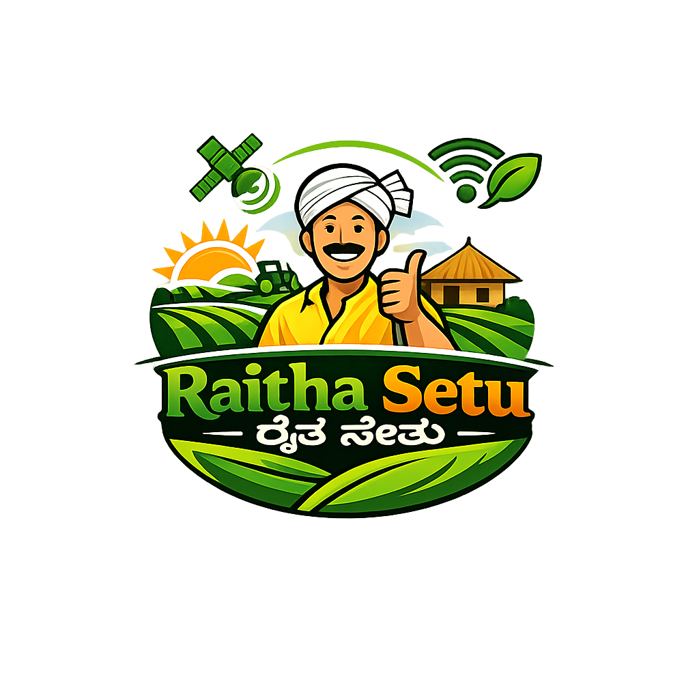

# Raitha Setu (AgriPulse) 🌾

**Raitha Setu** is a comprehensive, mobile-first agricultural ecosystem designed to empower farmers with cutting-edge AI technology, real-time market data, and a collaborative community. Built with React Native and powered by Google Gemini AI, it serves as a digital companion for modern farming.

---

## 🚀 Key Features

### 🤖 AI Farm Manager (Gemini Powered)
*   **Personalized Advice**: Get crop-specific guidance and pest control tips using Google's Gemini AI.
*   **Visual Diagnosis**: Support for plant photo analysis to identify diseases (via AI integration).
*   **Voice Assistant**: Interactive farming assistant with multilingual support.

### 📈 Market Insights & Mandi Prices
*   **Live Data**: Real-time price tracking from **Agmarknet (OGD)** for various city mandis.
*   **Price Comparison**: Compare prices across different regions (Bengaluru, Mandya, Hubli, etc.).
*   **Profit Analysis**: Identifying the highest profit mandis and optimal selling times.

### 🤝 Farmer Q&A (Community)
*   **Knowledge Sharing**: A peer-to-peer platform for farmers to ask questions and share expertise.
*   **Image Attachments**: Support for attaching photos to questions for better context.
*   **Verified Experts**: Expert answers highlighted for reliability.
*   **Firestore Backend**: Fully persistent and real-time community feed.

### 🚜 Machinery & Labour Hub
*   **Machinery Rentals**: Peer-to-peer marketplace for renting tractors, harvesters, and tools.
*   **Labour Matching**: Simplified platform to hire agricultural workers or find work.
*   **Booking Management**: Real-time notifications and status tracking for rental/job requests.

### 📅 Crop Advisor & Weather
*   **Cycle Tracking**: Monitor growth stages from sowing to harvest.
*   **Hyper-local Weather**: Integration with OpenWeather for precise farm-level weather updates.
*   **Smart Tips**: Daily farming tips based on current weather conditions.

---

## 🛠️ Tech Stack

*   **Frontend**: React Native (Expo SDK 52)
*   **Navigation**: Expo Router (File-based routing)
*   **Architecture**: Context API for State Management
*   **Backend**: Firebase (Auth, Firestore, Storage)
*   **AI**: Google Gemini API
*   **External APIs**: OpenWeather, Agmarknet (OGD)
*   **Languages**: English, Hindi, Kannada (Full Localization)

---

## 📦 Getting Started

### Prerequisites
*   Node.js (v18+)
*   Expo Go app on your mobile device
*   Firebase Project Credentials

### Installation

1. **Clone the repository**:
   ```bash
   git clone https://github.com/your-username/raitha-setu.git
   cd raitha-setu
   ```

2. **Install dependencies**:
   ```bash
   npm install
   ```

3. **Configure Environment Variables**:
   Create a `.env` file in the root directory and add your API keys:
   ```env
   EXPO_PUBLIC_FIREBASE_API_KEY=your_key
   EXPO_PUBLIC_FIREBASE_AUTH_DOMAIN=your_project.firebaseapp.com
   EXPO_PUBLIC_FIREBASE_PROJECT_ID=your_project_id
   EXPO_PUBLIC_GEMINI_API_KEY=your_gemini_key
   EXPO_PUBLIC_OPENWEATHER_API_KEY=your_weather_key
   EXPO_PUBLIC_OGD_API_KEY=your_mandi_api_key
   ```

4. **Start the development server**:
   ```bash
   npx expo start
   ```

---

## 📱 Screenshots

| Home Dashboard | Market Insights | AI Advisor |
| :---: | :---: | :---: |
|  |  |  |

---

## 📄 License
This project is licensed under the MIT License - see the [LICENSE](LICENSE) file for details.

---

**Developed with ❤️ for the farming community.**
